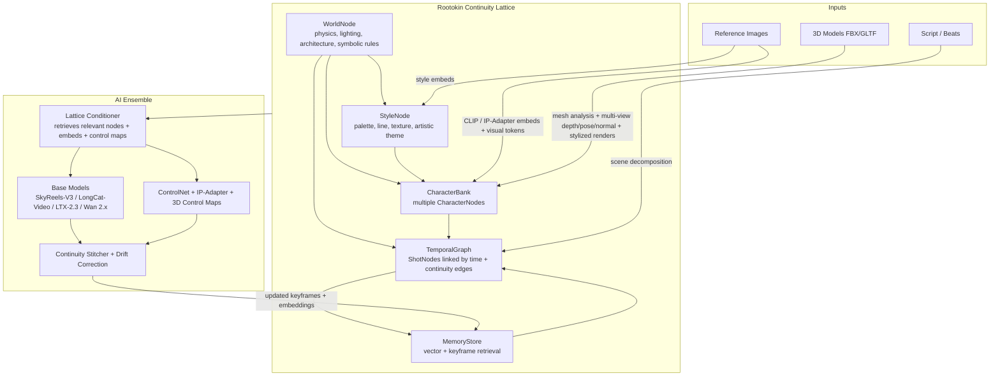

# Rootokin-Animation-Ai-

An attempt at creating an open-source animation AI for designing up to 30-minute videos with continuity.

## Architecture (Continuity Lattice)

```mermaid
graph TD
    subgraph Lattice["Rootokin Continuity Lattice"]
        W[WorldNode<br/>physics, lighting, architecture, symbolic rules]
        S[StyleNode<br/>palette, line, texture, artistic theme]
        C[CharacterBank<br/>multiple CharacterNodes]
        T[TemporalGraph<br/>ShotNodes linked by time + continuity edges]
        M[MemoryStore<br/>vector + keyframe retrieval]

        W --> S
        W --> C
        W --> T
        S --> C
        C --> T
        T --> M
        M --> T
    end

    subgraph Inputs
        IMG[Reference Images]
        D3[3D Models FBX/GLTF]
        SCRIPT[Script / Beats]
    end

    IMG -->|CLIP / IP-Adapter embeds + visual tokens| C
    IMG -->|style embeds| S
    D3 -->|mesh analysis + multi-view depth/pose/normal + stylized renders| C
    SCRIPT -->|scene decomposition| T

    subgraph Generator["AI Ensemble"]
        LATTICE_COND[Lattice Conditioner<br/>retrieves relevant nodes + embeds + control maps]
        BASE[Base Models<br/>SkyReels-V3 / LongCat-Video / LTX-2.3 / Wan 2.x]
        CTRL[ControlNet + IP-Adapter + 3D Control Maps]
        STITCH[Continuity Stitcher + Drift Correction]
    end

    Lattice --> LATTICE_COND
    LATTICE_COND --> BASE
    LATTICE_COND --> CTRL
    BASE --> STITCH
    CTRL --> STITCH
    STITCH -->|updated keyframes + embeddings| M
```
