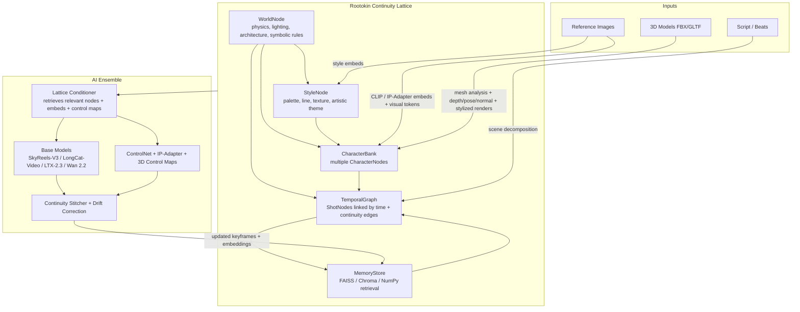

# Rootokin Animation Engine

**Open-source, continuity-first AI animation engine.**

Rootokin generates long-form (up to 30-minute) coherent stories while preserving character identity, world rules, artistic style and temporal continuity.  
It is deliberately anti-extractive and built for creative sovereignty.

> Rootokin = continuity, stability, non-extractive creative flow.  
> The open-source antidote to short-clip, paywalled systems.

## Core Features

- **Continuity Lattice** – hierarchical memory that tracks characters, world state, style, physics and temporal relationships
- **Reference image injection** with CLIP-compatible embeddings
- **3D model upload** → analysis → style-transfer control maps
- **Long-form generation** via an ensemble of open models (SkyReels-V3, LongCat-Video, LTX-2.3, Wan 2.2)
- Automatic keyframe extraction and memory updates after every shot
- Structured script engine that extracts characters, camera and emotion
- **FAISS / Chroma / NumPy memory backends** for scalable semantic retrieval

## Quick Start

```bash
# Install
pip install -e .
pip install open_clip_torch faiss-cpu opencv-python-headless pillow torch

# 1. Create a lattice
rootokin init-lattice --output lattice.json

# 2. Add a character with reference images (and optional 3D)
rootokin add-character lattice.json "Matt" \
  --image-dir ./examples/refs/matt \
  --model-3d ./examples/models/matt.fbx

# 3. Generate a continuous sequence
rootokin run lattice.json ./examples/simple_run/story.txt \
  --duration 2 \
  --characters Matt \
  --backend skyreels \
  --output-dir output/demo01
```

You can also instantiate the lattice manager directly:

```python
from pathlib import Path

from rootokin.lattice.continuity_lattice import LatticeManager

mgr = LatticeManager(vector_backend="faiss", persist_dir=Path("output/memory"))
```

## Architecture Overview



## Example Story

`examples/simple_run/story.txt`

```text
Matt enters the ancient library of roots. Wide shot. He looks determined.

Close-up on Matt’s face as he reaches for a glowing book. Emotion: wonder.

The guardian wolf appears between the shelves. Tracking shot. Tension rises.

Matt and the wolf face each other. Over-the-shoulder. Mutual respect.

They walk together into the light. Wide cinematic shot. Calm resolution.
```

## Preferred Open Models (2026)

| Priority | Model | Strength | License |
| --- | --- | --- | --- |
| 1 | SkyReels-V3 | Multi-reference + extension | Open |
| 2 | LongCat-Video | Native minutes-long continuation | MIT |
| 3 | LTX-2.3 | Highest quality + native audio | Open |
| 4 | Wan 2.2 | Strong character consistency | Apache 2.0 |

## Contributing

We welcome contributions that stay true to the Rootokin philosophy:

- **Continuity first** – never sacrifice long-term coherence for short-term quality
- **Open & non-extractive** – all models and code must be usable under permissive licenses
- **Modular** – new backends or memory stores should plug in cleanly

### How to contribute

1. Fork the repo
2. Create a feature branch
3. Add tests under `tests/`
4. Open a PR with a clear description of the continuity impact

See `CONTRIBUTING.md` for coding standards and the full contribution workflow.

Built for creators who refuse to accept that long coherent animation must be locked behind closed systems.
